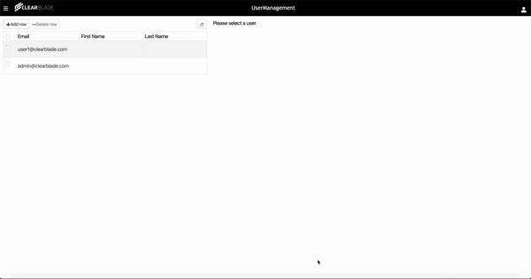

# ipm package: user-management-example

## Overview

This system contains a portal that demonstrates how to create and delete users, edit users&#39; fields, change users&#39; password, and modify users&#39; roles.

This is an ipm package, which contains one or more reusable assets within the ipm Community. The 'package.json' in this repo is a ipm spec's package.json, [here](https://docs.clearblade.com/v/3/6-ipm/spec), which is a superset of npm's package.json spec, [here](https://docs.npmjs.com/files/package.json).

[Browse ipm Packages](https://ipm.clearblade.com)

## Usage

 

## API

